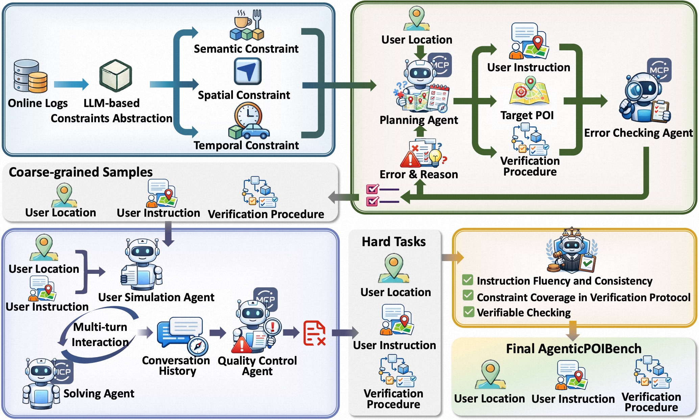

# AgenticPOIBench

## Overview

Modern POI search demands have evolved beyond simple queries toward complex, long-tail tasks involving intricate spatiotemporal and semantic constraints. While LLM-based agents offer a promising paradigm for tackling these challenges, existing benchmarks fall short — they fail to capture the diversity of authentic user demands, are severely decoupled from real-world scenarios, and lack systematic assessment of multi-turn reasoning during user interaction.

AgenticPOIBench bridges this gap by providing:

## Key Features

- 🔍 **Realistic Task Design** — An LLM-aided data synthesis pipeline grounded in multi-dimensional constraints extracted from massive real-world user requests on the Amap App, ensuring broad coverage of authentic search intentions.

- 📊 **Comprehensive Benchmark** — 199 evaluation samples spanning 25 distinct atomic constraints across semantic, spatial, and temporal dimensions.

- 🔌 **Live MCP Integration** — All tasks are executable through standard Model Context Protocol (MCP) interfaces connected to live map services from the Amap Platform, ensuring high-fidelity, real-world evaluation.

- ✅ **Automated Verification** — Executable verification scripts for rigorous, reproducible assessment of agent performance.

## Benchmark Construction

<p align="center">
  
</p>

<p align="center"><em>Figure 1: Benchmark construction overview.</em></p>

### Real-world Intent Distribution

To ensure AgenticPOIBench reflects authentic user behavior, we analyzed millions of anonymized POI search queries from the Amap Platform. Through statistical analysis, we extracted core user intent constraints across three dimensions—**temporal**, **spatial**, and **semantic** —alongside real geographic coordinates sampled from user sessions. These *seed constraints* ground synthetic tasks in actual usage patterns while enabling systematic control over diversity and difficulty.

### Hybrid Task Synthesis

We employ a multi-agent collaborative framework to transform real-world signals into executable, multi-turn evaluation tasks. The pipeline comprises five specialized LLM-based agents:

| Agent | Role |
|-------|------|
| **Planner Agent** | Constructs verifiable POI search scenarios grounded in seed constraints, identifies ground-truth POIs via MCP tools, and generates verification protocols |
| **Error Checking Agent** | Validates linguistic coherence, constraint coverage, and executes tool calls to confirm POI validity, initiating refinement loops when discrepancies arise |
| **User Simulator** | Converts static instructions into dynamic, multi-turn dialogues with progressive constraint disclosure, mimicking authentic exploratory search behavior |
| **Solving Agent** | Acts as the agent under test using randomly assigned SOTA models to prevent benchmark bias toward specific failure modes |
| **Quality Control Agent** | Retains instances where the Solving Agent fails to retrieve valid POIs, ensuring the benchmark is difficult|

### Expert Validation

Following automated generation, professional annotators curate samples against three criteria:

1. **Instruction fluency and realism**
2. **Comprehensive constraint coverage** in verification protocols
3. **Existence of valid POIs** confirmed via manual MCP execution

Valid instances are translated into deterministic scripts establishing ground-truth answer sets for automated evaluation.

### Dataset Statistics

AgenticPOIBench comprises **199** task instances spanning **25** atomic constraints (5 semantic, 12 spatial, 8 temporal). 

---

## Evaluation Framework

Dual-evaluation approach: **Programmatic Verification** (objective) + **LLM-based Judgment** (nuanced).

### 1. Programmatic Metrics

| Metric | Description |
|--------|-------------|
| **AR** | Achievement Rate - Task success allowing minor deviations |
| **pass^k** | Robust completion requiring success in all $k$ consecutive trials ($k \in \{1,2,3\}$) |
| **ATC** | Average Tool Calls - Lower is better (efficiency indicator) |

*All metrics computed over 3 trials with temperature=0.*

### 2. LLM-based Analysis

**Constraint Coverage Rate (CCR)**

$$\text{CCR} = \frac{\text{Exact constraints mentioned}}{\text{Total constraints}}$$

Measures alignment between user instructions and simulator dialogue.

**Failure Taxonomy**

- **Tool**: Call failures, arg errors, selection errors, result misread
- **Constraint**: Capture errors, application errors, state staleness  
- **Output**: ID mapping errors, malformed outputs
- **External**: User simulator early termination

---

## Project Structure

```
AgenticPOIBench/
├── samples/           # Contains the data samples for the benchmark(available now ✅)
├── data/              # Contains the data for the benchmark
├── results/           # Stores the benchmark's output, including evaluation scores and metrics
├── verify_scripts/   # Stores all the verify scripts used for the benchmark automated verification
└── src/               # Core functionality for the benchmark
    └── models/        # Houses model provider classes
```

> **Note:** The `samples/` directory is now available with sample data. All other components (data, verify_scripts, evaluation pipeline, etc.) will be released in future updates. **Quick Start**, **Installation and Usage**, and **Evaluation Results** sections will also be supplemented in a future release.

---

## Quick Start

*Quick Start instructions (environment setup, dependency installation, and how to run the benchmark) will be added in a future release. Please stay tuned.*

## Installation and Usage

*Detailed installation steps and usage instructions will be supplemented in a future release. Please stay tuned.*

## Evaluation Results

*Benchmark evaluation results and analysis will be supplemented in a future release. Please stay tuned.*
