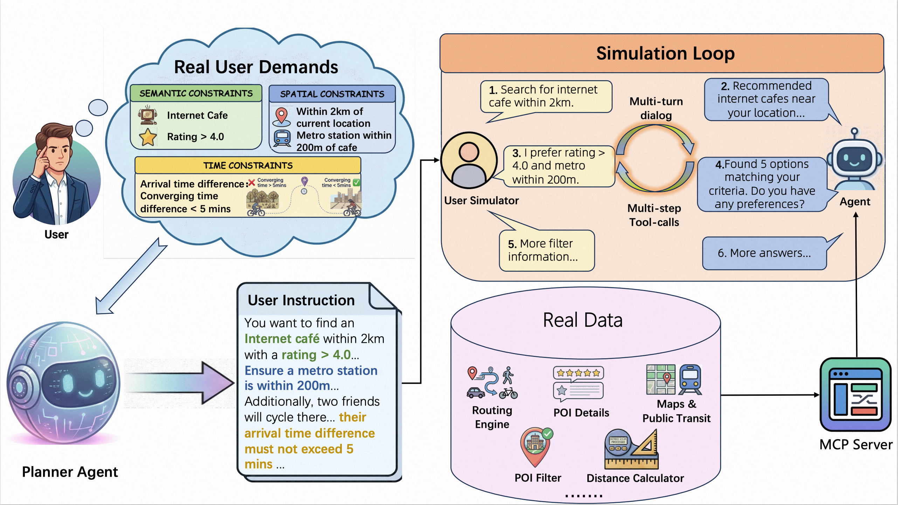

# AgenticPOIBench: A Realistic Benchmark for Agentic Spatiotemporal-Constrained POI Search

**Modern POI search** demands have evolved beyond simple queries toward complex, long-tail tasks involving intricate spatiotemporal and semantic constraints. **LLM-based agents** offer a promising paradigm for tackling these challenges. **AgenticPOIBench** offers a challenging POI search benchmark by introducing four features that better capture real-world agent behavior:

- **Broad Coverage of Authentic Intents**: We propose an LLM-aided data synthesis pipeline grounded in multi-dimensional constraints extracted from massive real-world user requests on the Amap App. This pipeline yields a comprehensive benchmark comprising 199 evaluation samples, which systematically spans 25 distinct atomic constraints across semantic, spatial, and temporal dimensions.

- **Multi-turn and Task Oriented User-Agent Interaction**: A dynamic, multi-turn dialogue evaluation framework requiring agents to actively track conversational states, proactively elicit missing constraints through clarifying questions, handle ambiguous or evolving inputs, and incrementally refine search strategies until the user's specific POI objective is successfully fulfilled.

- **MCP Integration** — All tasks are executable through standard Model Context Protocol (MCP) interfaces connected to live map services from the Amap Platform, ensuring real-world evaluation.

- **Reproducible Verification** — Executable verification scripts for rigorous, reproducible assessment of agent performance.


<p align="center">
  
</p>
<p align="center"><em>Benchmark advantage dimensions (to be paired with the summary table at the end of the document). A hyphen (--) denotes not applicable.</em></p>

## Table of contents

- [Overview](#overview)
- [Quick Start](#quick-start)
- [Available Commands](#available-commands)
- [Documentation](#documentation)
- [Project Structure](#project-structure)

## Overview

<p align="center">
  
</p>

<p align="center"><em></em></p>

**Agentic POI Bench** is a comprehensive benchmark for POI  search. Originating from **authentic user requirements**, it is built upon **real-world Model Context Protocol** rather than synthetic servers. It enables **objective and reproducible evaluations** through **task-oriented dialogues**.

## Quick Start

### 1. Install

```bash
git clone <YOUR_REPOSITORY_URL>
cd <repository-directory>
uv sync
```

This requires [uv](https://docs.astral.sh/uv/getting-started/installation/). If `./AgenticPOIBench` is not executable after clone, run `chmod +x AgenticPOIBench`.

Without `uv`, use a virtual environment and pinned dependencies:

```bash
python3 -m venv .venv && source .venv/bin/activate   # Windows: .venv\Scripts\activate
pip install -r requirements.txt
```

### 2. Set up API keys

```bash
export AMAP_MCP_KEY=...      # Amap / Gaode key for live MCP map tools
export LITELLM_API_KEY=...   # LLM provider key (LiteLLM; any supported provider)
```

The environment variable names default to `AMAP_MCP_KEY` and `LITELLM_API_KEY`; you can rename them in `src/config/config.yaml` under the `env` section (`amap_key_env`, `llm_key_env`).

### 3. Run an evaluation

```bash
./AgenticPOIBench verify
./AgenticPOIBench verify --resolve-secrets   # optional: validate config + secret resolution when keys are set

./AgenticPOIBench dialogue --eval-index 0
# Or a small index range:
./AgenticPOIBench dialogue --start-index 0 --end-index 2
```

Artifacts are written under `results/exp_<agent_model>_<UTC_timestamp>/`; dialogue JSON logs live in that directory’s `log/` subfolder (unless you pass `--artifact-dir`).

**End-to-end vs. offline steps:** `dialogue` already runs the full benchmark loop for each sample: after the LangGraph dialogue finishes, the harness runs the POI extractor (judge), verification scripts, and reward, then writes task JSON (with an `evaluation` block) and `summary.json` when applicable. You do **not** need to invoke `extractor` or `evaluate` for a normal run. Use `extractor` / `evaluate` when you want to **recompute** scores on **existing** task artifacts (e.g. different extract model, re-run verify, batch re-judge) without repeating dialogue and MCP tool calls. `pass-at-k` repeats that same dialogue-plus-evaluation pipeline `k` times per task.

> **Tip:** Run `./AgenticPOIBench <COMMAND> --help` for full flags, or see [Available Commands](#available-commands) below. If the top-level parser interferes with script flags, use `./AgenticPOIBench dialogue -- --help`.

## Available Commands

| Command | Description |
|---------|-------------|
| `dialogue` | End-to-end: LangGraph user–agent dialogue(s), then judge, verify, and reward; writes `results/exp_<model>_<ts>/`, `log/`, and task JSON (or `--artifact-dir`). |
| `extractor` | Run only the POI extractor / judge on one task JSON or a batch (by index); for offline reuse of saved trajectories. |
| `evaluate` | Re-run judge, verification, and reward on existing outputs; optionally merge into the task JSON. |
| `pass-at-k` | `k` independent end-to-end runs per task (each is dialogue + evaluation); optional Monte Carlo batches. |
| `pass_at_k` | Alias for `pass-at-k`. |
| `verify` | Check imports, config YAML, and optional secret resolution (e.g. `--resolve-secrets`). |

Use `./AgenticPOIBench <COMMAND> --help` for the target script’s full options. If parsing conflicts with top-level flags, insert `--` before script flags, e.g. `./AgenticPOIBench dialogue -- --help`.

---

## Project Structure

```
AgenticPOIBench/
├── AgenticPOIBench           # Repo-root CLI entry (bash → scripts/AgenticPOIBench.sh)
├── pyproject.toml            # Project metadata and dependencies (uv)
├── requirements.txt          # Pinned dependencies (pip / non-uv installs)
├── uv.lock                   # Lockfile for uv
├── README.md
├── data/
│   └── eval.json             # Benchmark eval tasks (default dataset; path configurable in config)
├── scripts/
│   ├── AgenticPOIBench.sh    # Invokes unified CLI with uv / venv / python3
│   ├── agentic_poi_bench_cli.py
│   ├── run_dialogue_once.py
│   ├── run_extractor_once.py
│   ├── run_evaluate_once.py
│   ├── run_pass_at_k.py
│   ├── verify_env.py
│   └── setup_venv.sh
├── verify_scripts/           # Per-task verification scripts (automated checks)
├── pics/                     # Figures for the README
├── results/                  # Created at runtime (experiment outputs; typically gitignored)
└── src/
    ├── cli_batch.py          # Shared batch CLI flags and progress UI
    ├── concurrency.py        # MCP / LLM concurrency limits
    ├── experiment_paths.py   # Naming and layout under results/exp_*
    ├── config/               # config.yaml and settings loading
    ├── data/                 # Eval records and eval JSON ingestion
    ├── evaluation/           # Extractor, validator, completed-run evaluation, Pass@k summaries
    ├── orchestration/        # LangGraph dialogue loop, Pass@k orchestration, run summaries
    ├── persistence/          # Dialogue and task JSON read/write
    ├── prompt/               # prompt.yaml (agent / user / extractor templates)
    ├── simulation/           # User simulator and POI agent nodes
    └── tools/                # Amap MCP integration helpers
```

> **Note:** All benchmark task data for the default setup lives in `data/eval.json`; change `paths.eval_json` in `src/config/config.yaml` if you point to another file. 


